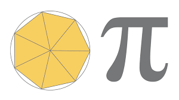
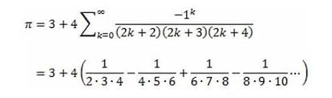

# Advanced Multithreading

## Calculating π

### π Number

The number π is a mathematical constant that is the ratio of a circle's circumference to its diameter, approximately equal to 3.14159. The number π appears in many formulae across mathematics and physics. It is an irrational number, meaning that it cannot be expressed exactly as a ratio of two integers, although fractions such as 22/7 are commonly used to approximate it. Consequently, its decimal representation never ends, nor enters a permanently repeating pattern. It is a transcendental number, meaning that it cannot be a solution of an equation involving only finite sums, products, powers, and integers. The transcendence of π implies that it is impossible to solve the ancient challenge of squaring the circle with a compass and straightedge. The decimal digits of π appear to be randomly distributed, but no proof of this conjecture has been found.

### Calculation of π

Calculating the value of π (pi) has fascinated mathematicians for centuries, and several algorithms have been developed to compute it with increasing precision. Here are some of the most prominent algorithms:

1. **Archimedes' Method (Polygon Approximation)**
   - **Description:** Archimedes approximated π by inscribing and circumscribing polygons around a circle. By increasing the number of polygon sides, the approximation of π becomes more accurate.
   - **Advantages:**
      1. Historically significant as one of the first known methods.
      2. Simple geometric interpretation.
   - **Disadvantages:**
      1. Slow Convergence: Requires a very large number of sides to achieve high precision.
      2. Computational Intensity: As the number of sides increases, the calculations become more complex and intensive.

   
   

2. **Leibniz Formula for π**
   - **Description:** This series formula, discovered by James Gregory and Gottfried Wilhelm Leibniz, expresses π as:
   
     
   
   - **Advantages:**
      1. Conceptually simple and easy to understand.
      2. Can be implemented with basic programming skills.
   - **Disadvantages:**
      1. Very Slow Convergence: This series converges extremely slowly, requiring millions of terms to achieve a modest number of decimal places.
      2. Impractical for High Precision: Due to its slow convergence, it's not suitable for high-precision calculations.

3. **Nilakantha Series**
   - **Description:** This series, derived by Indian mathematician Nilakantha Somayaji, improves the convergence rate:
   
     
   
   - **Advantages:**
      1. Faster convergence than the Leibniz series.
      2. Suitable for manual calculations.
   - **Disadvantages:**
      1. Slow Convergence: Although faster than the Leibniz series, it still converges slowly compared to modern algorithms.
      2. Inefficiency: Requires a large number of iterations for high precision, making it inefficient for practical purposes.

4. **Monte Carlo Methods**
   - **Description:** Uses random sampling to estimate the value of π. For example, by randomly placing points in a unit square and counting how many fall inside a quarter circle.
   

   

   - **Advantages:**
      1. Simple and can be used to illustrate principles of probability and statistics.
      2. Easy to parallelize for computational purposes.
   - **Disadvantages:**
      1. Statistical Nature: Results are probabilistic, not deterministic, meaning they converge to the true value with a certain probability.
      2. Low Precision: Requires a very large number of samples to achieve high precision.
      3. Resource Intensive: Can be computationally expensive for high precision due to the sheer number of samples needed.

5. **Gauss-Legendre Algorithm**
   - **Description:** This iterative algorithm quickly converges to π using arithmetic-geometric means. It involves iterating through a sequence of arithmetic and geometric means.
   - **Advantages:**
      1. Extremely rapid convergence.
      2. Suitable for high-precision calculations.
   - **Disadvantages:**
      1. Complexity: The algorithm is mathematically complex and difficult to implement correctly.
      2. Memory Usage: Requires significant memory for high-precision calculations due to large intermediate values.

6. **Bailey–Borwein–Plouffe (BBP) Formula (my choice)**
   - **Description:** A spigot algorithm that can directly compute the nth digit of π in base 16 (hexadecimal) without needing to compute the preceding digits.
   

   
   

   - **Advantages:**
      1. Allows digit extraction, meaning specific digits of π can be calculated without the entire sequence.
      2. Efficient for computing π in a distributed or parallel computing environment.
   - **Disadvantages:**
      1. Base Dependency: Works efficiently for base-16 (hexadecimal) but is not straightforward for base-10 digit extraction.
      2. Complexity: More complex to understand and implement compared to simpler series.

7. **Chudnovsky Algorithm**
   - **Description:** This algorithm is based on Ramanujan's π formulas and converges extremely rapidly. The formula is:
   

   

   
   - **Advantages:**
      1. Extremely fast convergence.
      2. Used in most modern high-precision π computations.
   - **Disadvantages:**
      1. Implementation Complexity: Involves complex mathematical functions and requires arbitrary-precision arithmetic.
      2. Memory Usage: High memory usage for large calculations due to the size of intermediate terms.

8. **Machin's Formula**
   - **Description:** This is an arctangent formula for π, such as:

     

   
   - **Advantages:**
      1. Fast convergence compared to simple series.
      2. Can be combined with other arctangent formulas for optimization.
   - **Disadvantages:**
      1. Multiple Arctangents: Requires computation of multiple arctangent values, which can be computationally expensive.
      2. Convergence: While faster than simple series, it is still slower compared to algorithms like Chudnovsky or Gauss-Legendre for very high precision.

### Bailey–Borwein–Plouffe (BBP) Formula

The Bailey–Borwein–Plouffe formula (BBP formula) is a formula for π. It was discovered in 1995 by Simon Plouffe and is named after the authors of the article in which it was published, David H. Bailey, Peter Borwein, and Plouffe. Before that, it had been published by Plouffe on his own site. The formula is:

The BBP formula gives rise to a spigot algorithm for computing the nth base-16 (hexadecimal) digit of π (and therefore also the 4nth binary digit of π) without computing the preceding digits. This does not compute the nth decimal digit of π (i.e., in base 10). But another formula discovered by Plouffe in 2022 allows extracting the nth digit of π in decimal. BBP and BBP-inspired algorithms have been used in projects such as PiHex for calculating many digits of π using distributed computing. The existence of this formula came as a surprise. It had been widely believed that computing the nth digit of π is just as hard as computing the first n digits.

### Execute the Program

1. Start the program from main.
2. Enter the desired floating point.
3. Available threads are made by thread pool to calculate π.
4. In a loop, it calculates every series with a thread.
5. Result is rounded by floating point.
6. And π number with the floating number you chose is shown.

### Key Features

- **Multithreaded Calculation:**
  Utilizes a thread pool created with `Executors.newFixedThreadPool` to leverage multiple CPU cores for concurrent computation, enhancing performance.
- **AtomicReference for Thread Safety:**
  `AtomicReference` is used to maintain the cumulative sum of π terms safely across multiple threads, ensuring thread-safe updates without the need for complex synchronization mechanisms.
- **Adaptive Precision Handling:**
  The `BigDecimal` precision is managed dynamically, adjusting to the desired floating-point precision specified by the user.
- **Graceful Shutdown:**
  Ensures that all threads terminate gracefully within a specified time frame (10 minutes), with provisions for forced shutdown in case of delays.
- **User Interaction:**
  The program allows users to input the number of digits after the decimal point they wish to calculate for π, facilitating interactive execution and testing.

### Functions

- **Main Method:**
   - Continuously prompts the user for input, calculates π to the specified precision, and measures the time taken for each computation.
   - Exits gracefully if the user inputs 0.
- **calculate Method:**
   - Sets up the thread pool and initializes an `AtomicReference` for the sum.
   - Spawns a specified number of threads (equal to the number of available processors) to compute terms of the BBP series concurrently.
   - Waits for all threads to complete their execution and then returns the calculated value of π as a string.
- **Calculator Class (Runnable):**
   - Each thread calculates its portion of the BBP series, starting from a specific index and incrementing by the number of threads.
   - Terms are calculated using the `computeTerm` method, and the local sum is updated and added to the global sum in a thread-safe manner.
- **computeTerm Method:**
   - Implements the BBP formula to compute the term at a given index with high precision.

### Performance and Efficiency

- **Parallelism:**
  By utilizing multiple threads, the program can significantly reduce the time required to compute π, especially for a large number of digits. The use of `AtomicReference` and synchronization ensures thread safety and consistency of the sum, preventing race conditions.
- **Precision Handling:**
  The program dynamically adjusts the precision based on user input, ensuring that the computations are accurate to the specified number of digits.
- **Resource Management:**
  Efficiently manages system resources by utilizing a fixed thread pool and properly handling thread termination.

### Conclusion

The provided code is a well-designed multithreaded program for calculating π to a specified precision using the BBP formula. It leverages modern Java concurrency features such as `ExecutorService` and `AtomicReference` to ensure efficient and thread-safe computation. The user-friendly interface and graceful handling of inputs and thread termination make it a robust solution for calculating π with high precision. The use of multiple threads and careful management of precision and resource allocation contribute to its performance and efficiency.

## Semaphore

### What is a Semaphore?

In computer science, a semaphore is a variable or abstract data type used to control access to a common resource by multiple threads and avoid critical section problems in a concurrent system such as a multitasking operating system. Semaphores are a type of synchronization primitive.

### Overview

The provided code demonstrates a synchronization problem where multiple threads (operators) attempt to access a shared resource concurrently. The goal is to ensure that only a maximum of 2 operators can access the resource simultaneously. This is achieved using a Semaphore.

### Components

- **Operator Class**
   - Represents a thread (operator) that attempts to access the shared resource.
   - Each operator must acquire a permit from the semaphore before accessing the resource and release the permit after finishing.
- **Resource Class**
   - Represents the shared resource that the operators are trying to access.
   - The `accessResource` method simulates resource access by putting the thread to sleep for a short period.
- **Controller Class**
   - Contains the main method where the semaphore is initialized and operator threads are started.

## Resources

- [Formulas to find π (Wikipedia)](https://en.wikipedia.org/wiki/Pi)
- [Semaphore (programming) (Wikipedia)](https://en.wikipedia.org/wiki/Semaphore_(programming))
- [Semaphore (Geeks for Geeks)](https://www.geeksforgeeks.org/semaphore-in-java/)
